1. Introduction
========================

 BladeAI is a Wind Turbine Preliminary Design tools integrated with aero,structure,hawcstab2 simulation and try to use AI agent to do Stability Analysis.

BladeAI Work Flow
------------------

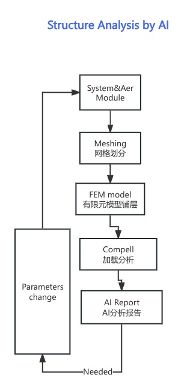

1.1 General Description
-----------------------

introduction:

     BladeAI tool takes input from sys module to aerodynamic,structure AI analysis on structure frequency domain and damping domain. all functionality are web based conversation on parameter settings and run individuly， the codes is opensource so you are free to download and even contribute,if you have any question let me know, and I'd like to discuss with you.

     BladeAI 工具从风机系统模块（叶片Airfoils,shapes and then make geometry lamplain, stiffness,finally hawstab2 and AIReport）开始，然后是气动、结构模块（有限元FEM）最后用AI产生专业分析报告，这个是一个使用AI的尝试，希望感兴趣的朋友使用病提出宝贵意见。该代码是开源的，欢迎下载和贡献，谢谢！

Main Functions

        - sys module take input of system variables which  all input variables, detail see Appendix A 

        - shape_analys shows different shapes compare as options: Chord, rel_Thickness, abs_Thinkness and Twist

        - bem modules will take a shape to calculate  stiffness matrics

        - hawcstab2 will calculate and get a tranditional Compell draw

        - AI  moduels will create markdown file which could download to look at any web browser

1.2  BladeAI Quick View include Video demo
-------------------------------------------

   - BladeAI/docs/demoVideo                -- all demo video here which show the main functionality

   - BladeAI/docs/sphinx/build/html/index.html   -- open the sphinx documentation portal to see detail 

工具说明
        1. v0.1 是调试版本，目前开通2个用户,避免多人同时使用一个用户

        2. 说明书正在写，可以通过视频演示部分了解系统功能和开发

BladeAI v0.1工具开发状态

        1. 后台求解器并行已经解决，4核求解有限元约17分钟

        2. 部署到云（Linux Slurm）script 调试成功

        3. 后台从翼型到求刚度矩阵-稳定性分析基本调好

        4. AI自动出报告初步成功但需要人工，后续连接API变全自动

        5. AI功能还需要深度开发，尝试grok4收费功能

.. image:: _static/workflow.jpg
       :align: center

1.2.1 Idea Draft
-----------------
|
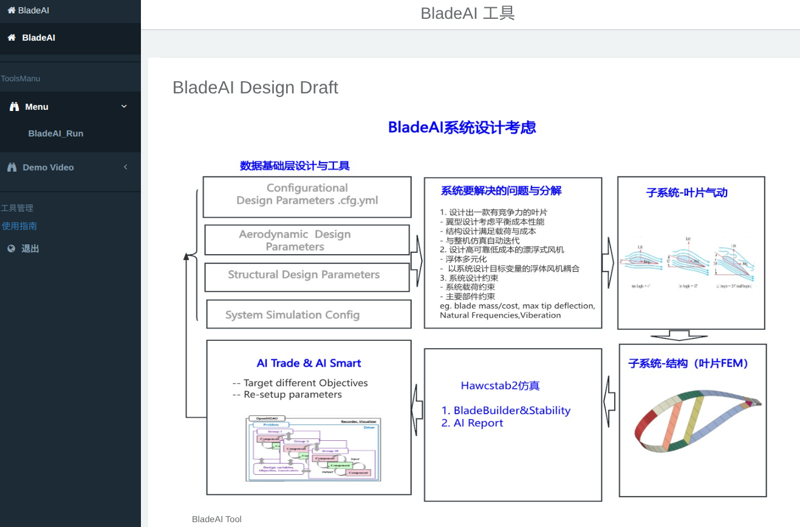

1.2.2 Function SystemIter
-----------------------------

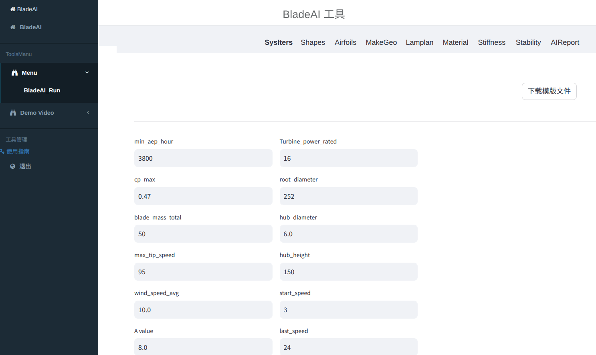

1.2.3 Function Shapes
-----------------------------
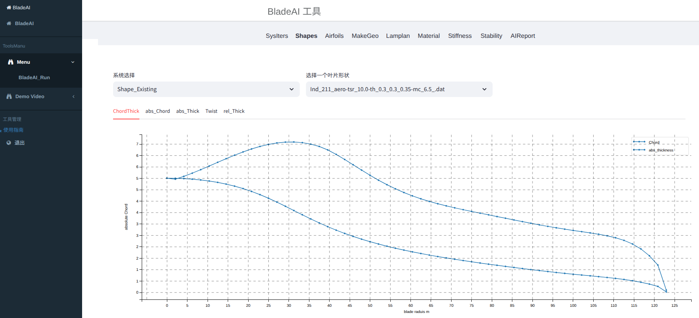

1.2.4 Function Airfoils
-----------------------------

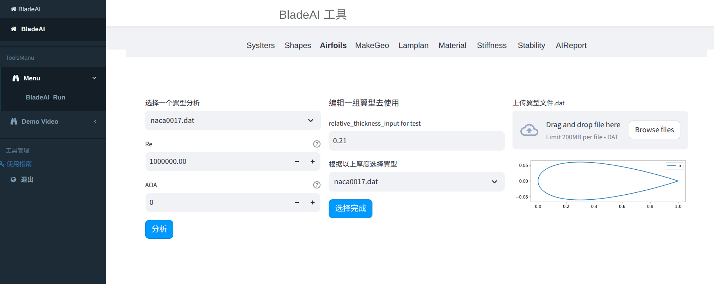

1.2.5 Function MakeGeo
-----------------------------

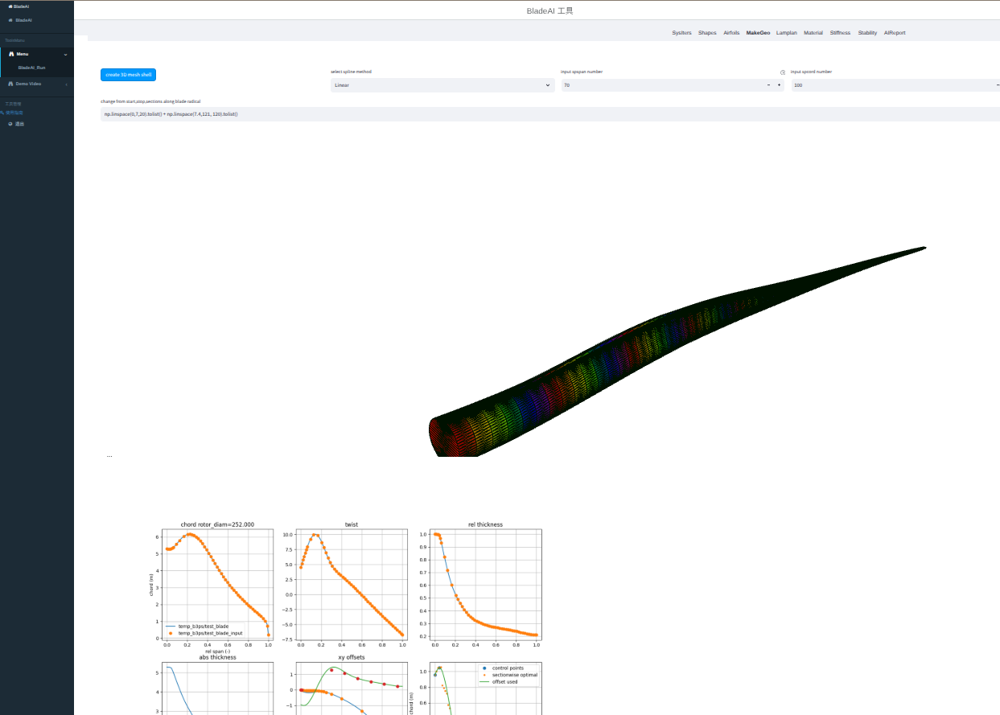

1.2.6 Function Lamplan
-----------------------------

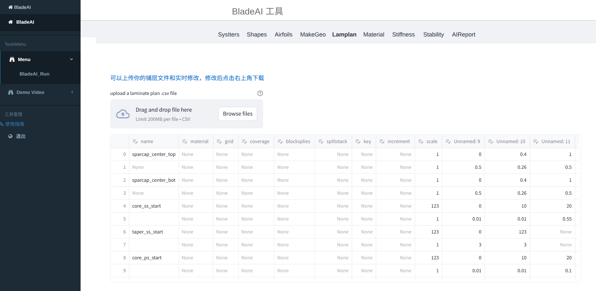

1.2.7 Function Materials
-----------------------------

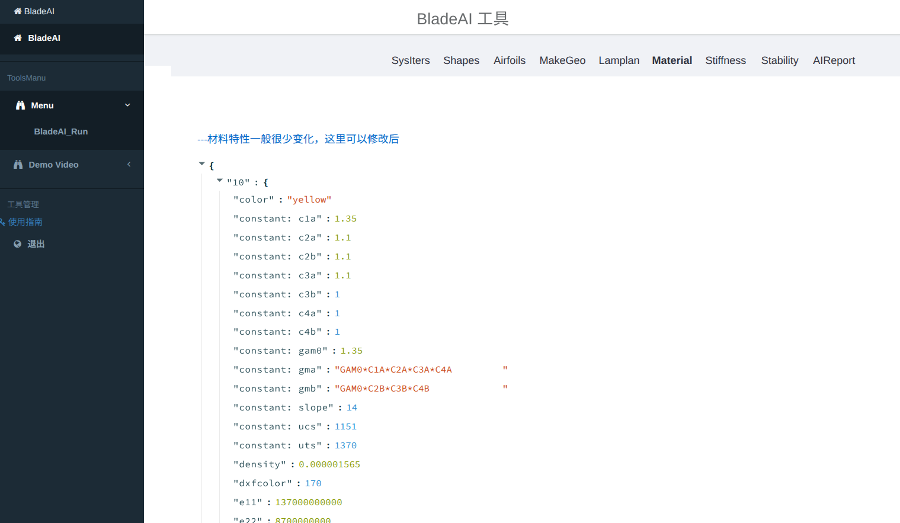

1.2.8 Function Stiffness
-----------------------------

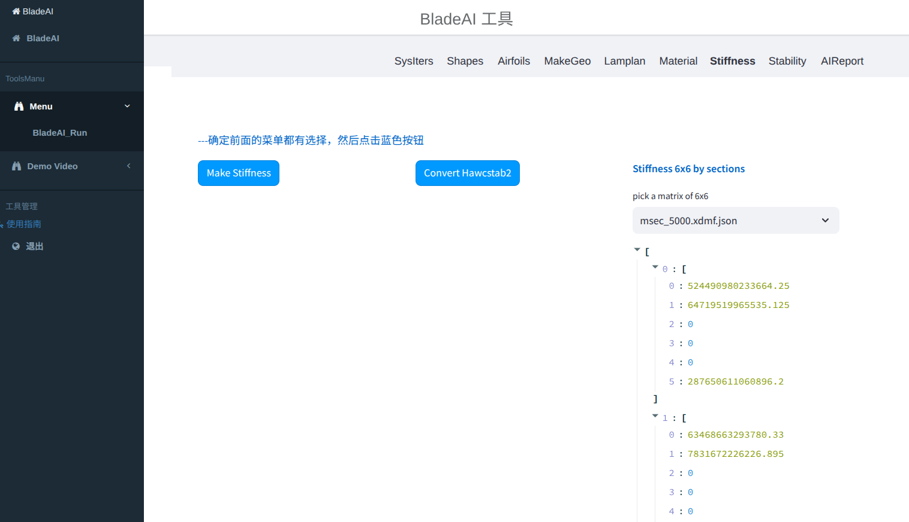

1.2.9 Function Stability
-----------------------------

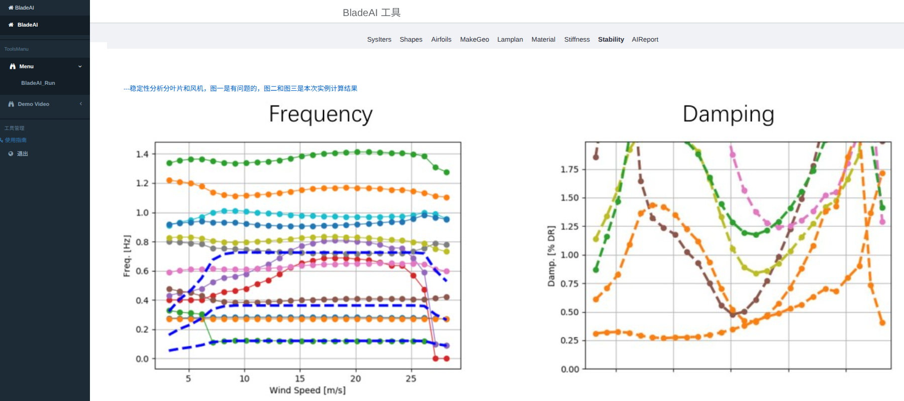

1.2.10 Function AIReport
-----------------------------

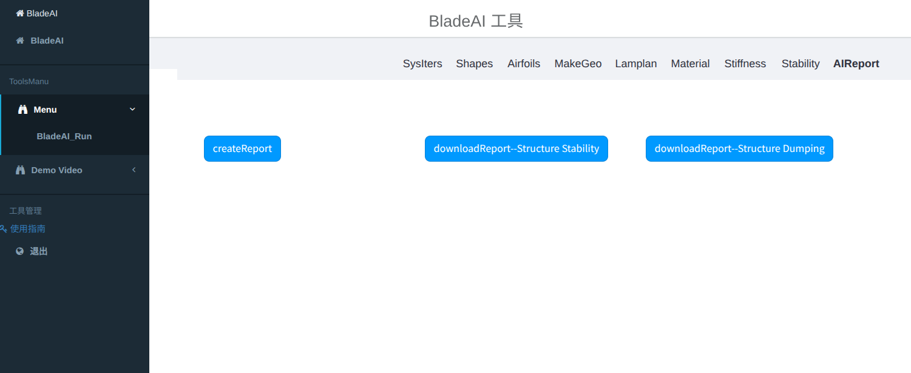

1.3 Development source tree
---------------------------

.. program-output:: tree -L 2 ../../../Application

1.4 Deliveries location
-----------------------

1.4.1 Codes work on:
---------------------

   - git clone git@gitee.com:michaelxdzhang/blade-ai.git

1.4.2 Docs location (Sphinx Style)

  - BladeAI/docs/sphinx/build/html/index.html   ---just open the file use any browser to scan Introduction which has general explain and web images

1.4.3 demo video location
---------------------------

   - /BladeAI/docs/video             ----this directory has the demo screen shuts

1.5 Main Manu 
------------------

1.6 Appendix
---------------------------

appendix A system variables-- system.cfg

.. program-output:: cat ../../../Application/sys/system.cfg

